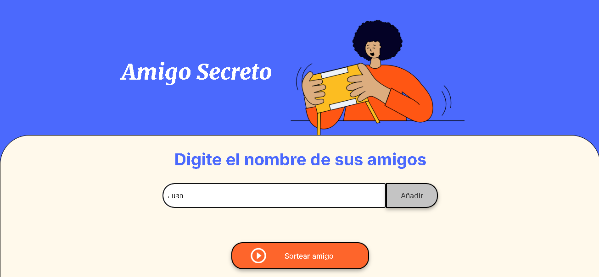
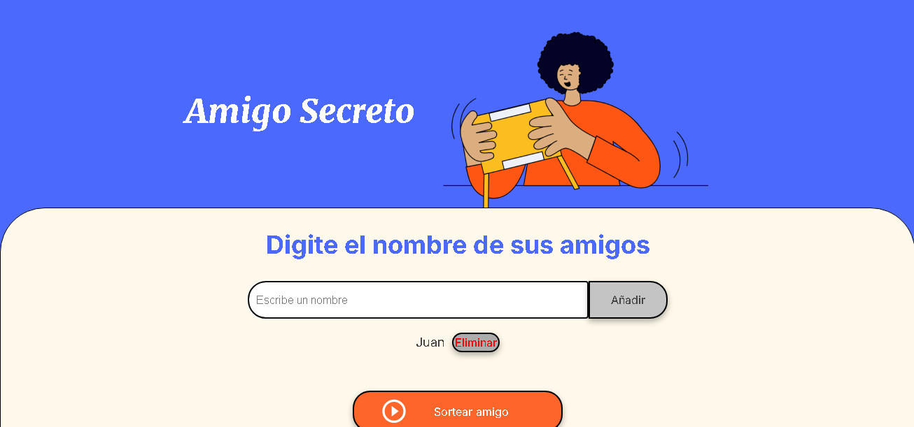
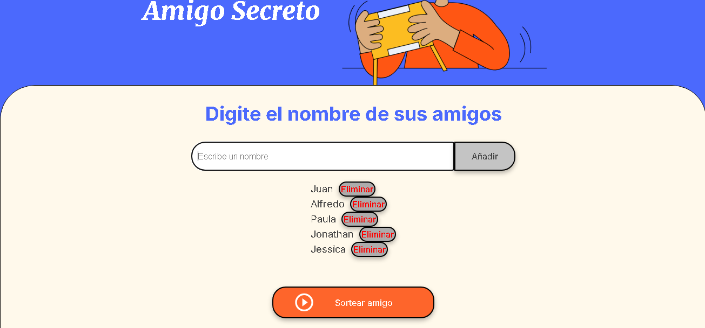
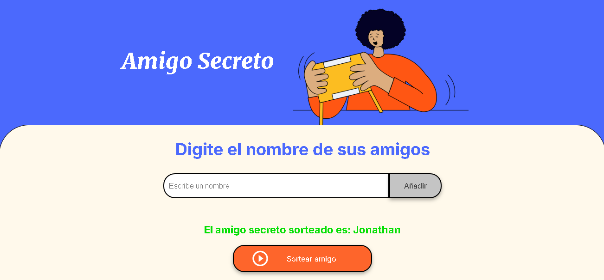

# Desafío Amigo Secreto

¡Bienvenido al repositorio del desafío Amigo Secreto! Este proyecto demuestra mis conocimientos de JavaScript, usando HTML y CSS assets. Mediante el desarrollo de una aplicación web simple y divertida que ayuda a los usuarios a seleccionar aleatoriamente un *amigo secreto*.

## Descripción del Proyecto

El desafío Amigo Secreto permite a los usuarios ingresar una lista de nombres de amigos en una página web. Una vez que se ingresan los nombres, un botón activa un proceso de selección aleatoria para determinar quién será el amigo secreto del usuario.

## Características

- Interfaz fácil de usar para agregar nombres de amigos.

- Visualización dinámica de la lista de amigos.

- Selección aleatoria de nombres con un solo clic.

## Archivos Bases

* HTML para la estructura de la página web.

* CSS para el diseño y estilo de la aplicación.

* JavaScript para la lógica de selección aleatoria y comportamiento dinámico.

## Configuración y Uso

Clona este repositorio:

`git clone https://github.com/tuusuario/desafio-amigo-secreto.git`

Navega al directorio del proyecto:

`cd desafio-amigo-secreto`

Abre el archivo index.html en tu navegador:

`open index.html`

## Cómo Usar

1. Escribe los nombres de tus amigos en el campo de entrada.

2. Haz clic en el botón Añadir para añadir cada nombre a la lista.

4. Cuando estés listo, haz clic en el botón Sortear Amigo para seleccionar aleatoriamente un amigo secreto.

